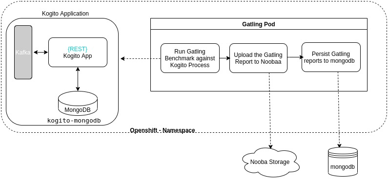
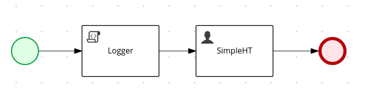

# Table of Contents
* [Kogito Benchmark](#kogito-benchmark)
  * [System Architecture](#system-architecture)
  * [Business Process Model](#business-process-model)  
  * [Test strategy](#test-strategy)
  * [Metrics specifications](#metrics-specifications)
  * [Results](#results)
  * [Test Procedures](#test-procedures)
  * [Results](#reults)
  * [References](#references)
  * [Troubleshooting](#troubleshooting)

# Kogito Benchmark

Purpose of this project is benchmarking [Kogito](https://kogito.kie.org/) application for a defined business process model 
using MongoDB as persistence store.
The objective is to define a repeatable procedure to generate structured data for the metrics defined in [Metrics specifications and results](#metrics-specifications-and-results),
to easily monitor system performance as the product evolves.  

The following table shows the configuration of the test environment, 
| Target   |      Specs      |
|----------|:-------------:|
| Kogito version |  1.11.0.Final |
| Runtime environment |  [OpenShift](https://console-openshift-console.apps.mw-ocp4.cloud.lab.eng.bos.redhat.com) |
| JVM runtime | Quarkus |
| Data persistence | MongoDB | 
| Test Client | todo [Gatling](https://gatling.io/) |

## System Architecture
The following diagram illustrates the basic architecture of the testing scenario:

TODO: update image VM1 - OCP


**Note**: `Data-Index` infrastructure is not part of this initial setup. Also, the initial metrics will not 
validate that the Kafka broker actually sends the expected events.

For establishing of a baseline the following architecture was used:

TODO: VM1 - VM2 image

## Business Process Model
TODO: Mention that we started with the process-quarkus-example, but switched to a more simple process?

The Business Process Model under test consists of 1 script task and 1 human task.
In particular, we  will create new instances of the `TestData` data element using a GET REST request.


## Test strategy

Constant concurrent users - a constant number of users is repeatedly invoking the test scenario. Each time a request finishes a new request is done.

## Metrics specifications

The test scenario were executed with varying pod numbers (# of replicas, in case of testing application on VM, all tests were on 1 app container) and number of users. 
Tests were run for a duration of 2 minutes. 

## Results

???? A warmup run needs to be executed as a separate test before each test for a newly created application pod

TODO Integrate: Jude Results

## Procedures
* [Deployment on OCP](test-envs/deploy-OCP/deploy-app/README.md)
* [Deployment on VM](test-envs/deploy-VM/README.md)
* [Test Run from VM](test-envs/test/README.md)

## References
* [Project Requirements](https://docs.google.com/document/d/1AtAfTiFSB2VcI84zg-ocPTnYy_1HCK556FiWt_iPkiM/edit?usp=sharing)
* [Asana Board](https://app.asana.com/0/1200541157872337/board)
* [GitHub repository](https://github.com/RHEcosystemAppEng/kogito-benchmark)

## Troubleshooting

TODO
* Fetch Orders from REST API: the URL is `ROUTE_OF_APPLICATION/orders`
* Access `Swagger UI`: the URL is `ROUTE_OF_APPLICATION/swagger-ui`
* Every time a new `Order` is defined, the related Pod in the OCP platform will log a message like:
```text
Order has been created Order[12345] with assigned approver JOHN
```

