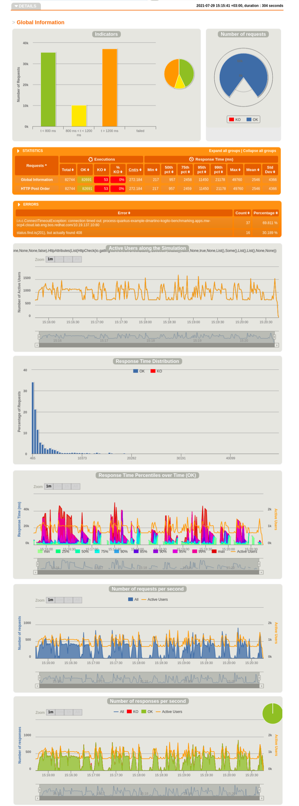

# Table of Contents
* [Kogito Benchmark](#kogito-benchmark)
  * [System Architecture](#system-architecture)
  * [Business Process Model](#business-process-model)  
  * [Test strategy](#test-strategy)
  * [Metrics specifications and results](#metrics-specifications-and-results)
  * [Procedures](#procedures)
  * [References](#references)
  * [Troubleshooting](#troubleshooting)

# Kogito Benchmark

Purpose of this project is benchmarking [Kogito](https://kogito.kie.org/) application for a defined business process model 
using MongoDB as persistence store.
The objective is to define a repeatable procedure to generate structured data for the metrics defined in [Metrics specifications and results](#metrics-specifications-and-results),
to easily monitor system performance as the product evolves.  

The following table shows the configuration of the test environment, 
| Target   |      Specs      |
|----------|:-------------:|
| Kogito version |  1.8.0.Final |
| Runtime environment |  [OpenShift](https://console-openshift-console.apps.mw-ocp4.cloud.lab.eng.bos.redhat.com) |
| JVM runtime | Quarkus |
| Data persistence | MongoDB | 
| Testing framework | [Gatling](https://gatling.io/) |

## System Architecture
The following diagram illustrates the basic architecture of the testing scenario:


**Note**: `Data-Index` infrastructure is not part of this initial setup. Also, the initial metrics will not 
validate that the Kafka broker actually sends the expected events.

Gatling Pod is having two containers - Each container runs the tasks sequentially one after another. One container runs the Gatling(Scala Performance Test Suite) code to do the benchmarking against kogito application. Another container uploads the report generated by gatling to the centralized Noobaa storage.

## Business Process Model
The Business Process Model under test comes from the [Process + Quarkus example](https://github.com/kiegroup/kogito-examples/tree/stable/process-quarkus-example)
application, that is a simple process service for ordering items.
In particular, we  will create new instances of the `Order` data element using a POST REST request, defined by the [orders](https://github.com/kiegroup/kogito-examples/blob/stable/process-quarkus-example/src/main/resources/org/kie/kogito/examples/orders.bpmn2)
process:


## Test strategy
[Daniele]: can we add more details? Maybe an example of how the requests are distributed along the time

Strategy 1: constant number of users at all times 
Gatling:  `constantConcurrentUsers`

Strategy 2: number of users achieved during given time
Gatling: `rampUsers`

Strategy 3: constant number of requests per second
Gatling: `constantUsersPerSec`

## Metrics specifications

**Strategy 1**

| test run | pods | users | time (min) |
|----------|----|----|----|
| 1 | 1 | 100 | 5 |
| 2 | 2 | 100 | 5 |
| 3 | 3 | 100 | 5 |
| 4 | 1 | 100 | 15 |
| 5 | 3 | 100 | 15 |

**Strategy 2**

| test run | pods | users | time (min) |
|----------|----|----|----|
| 1 | 1 | 50000 | 10 |

**Strategy 3**

Gatling external

| test run | pods | users | time (min) |
|----------|----|----|----|
| 1 | 1 | 700 | 5 | 
| 2 | 3 | 700 | 5 |


## Results

**Strategy 1**

| Run | Latency 95% PCT (ms) | Latency 99% PCT (ms) | Av. Response (ms) | Peak Response (ms) | Error Rate (%)  | Throughput (transactions / s - TPS) | Runtime memory (MiB / pod) | CPU Usage (m / pod) | Runtime startup (ms) |   
|----|----|----|----|----|----|----|----|----|----|
| 1 | 1253 | 1948 | 617 | 6782 | 0 | 160 | 1107 | 768 | |  
| 2 | 644 | 1414 | 518 | 3557 | 0 | 191 | 1287 (639,648) | 598 (275,323) | |  
| 3 | 1004 | 1648 | 557 | 4122 | 0 | 178 | 1385 (501,512,372) | 928 (268,258,402) | |
| 4 | 1438 | 2021 | 636 | 7770 | 0 | 156 | 3096 | 423 | |  
| 5 | 734 | 1499 | 534 | 5406 | 0 | 186 | 3668 (1416,1038,1432) | 973 (271,437,265) | |

**Strategy 2**

| Run | Latency 95% PCT (ms) | Latency 99% PCT (ms) | Av. Response (ms) | Peak Response (ms) | Error Rate (%)  | Throughput (transactions / s - TPS) | Runtime memory (MiB / pod) | CPU Usage (m / pod) | Runtime startup (ms) |   
|----|----|----|----|----|----|----|----|----|----|
| 1 | 986 | 5690 | 608 | 8454 | 0 | 83 | 1216 | 586 | |  

**Strategy 3**

| Run | Latency 95% PCT (ms) | Latency 99% PCT (ms) | Av. Response (ms) | Peak Response (ms) | Error Rate (%)  | Throughput (transactions / s - TPS) | Runtime memory (MiB / pod) | CPU Usage (m / pod) | Runtime startup (ms) |   
|----|----|----|----|----|----|----|----|----|----|
| 1 | 25000 | 36900 | 12000 | 84000 | 46 | 648 | - | - | |  
| 2 | 61000 | 63000 | 20000 | 68000 | 92 | 600 | - | - | | 

Gatling in same OCP project - 1 pod - 15 minutes test runs

| Run | Latency 95% PCT (ms) | Latency 99% PCT (ms) | Av. Response (ms) | Peak Response (ms) | Error Rate (%)  | Throughput (transactions / s - TPS) | Runtime memory (MiB / pod) | CPU Usage (m / pod) | Runtime startup (ms) |   
|----|----|----|----|----|----|----|----|----|----|
|20210821073521681|100|376|32|1183|0|20| | | |
|20210821075409461|85|360|30|1309|0|20| | | |
|20210821081717675|125|451|38|2098|0|30| | | |
|20210821084740136|30004|33084|2214|45681|24|50| | | |
|20210821090817631|200|579|47|2228|0|40| | | |
|20210821111043247|375|1009|69|2372|0|50| | | |
|20210823050706449|28355|30004|8742|30036|3|58| | | |
|20210823053549281|30004|30006|4161|30047|20|49| | | |
|20210824095741895|22026|29282|3738|30015|2|49| | | |





## Procedures
* [Configuration](./deploy/README.md)
* [Test procedure](./test/README.md) **WIP**

## References
* [Project Requirements](https://docs.google.com/document/d/1AtAfTiFSB2VcI84zg-ocPTnYy_1HCK556FiWt_iPkiM/edit?usp=sharing)
* [Asana Board](https://app.asana.com/0/1200541157872337/board)
* [GitHub repository](https://github.com/RHEcosystemAppEng/kogito-benchmark)

## Troubleshooting
* Fetch Orders from REST API: the URL is `ROUTE_OF_APPLICATION/orders`
* Access `Swagger UI`: the URL is `ROUTE_OF_APPLICATION/swagger-ui`
* Every time a new `Order` is defined, the related Pod in the OCP platform will log a message like:
```text
Order has been created Order[12345] with assigned approver JOHN
```

