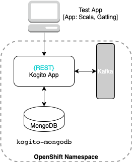

# Table of Contents
* [Kogito Benchmark](#kogito-benchmark)
 * [System Architecture](#system-architecture)
 * [Test strategy](#test-strategy)
 * [Metrics specifications](#metrics-specifications)
 * [Procedures](#procedures)
 * [References](#references)

# Kogito Benchmark

Purpose of this project is benchmarking [Kogito](https://kogito.kie.org/) application for a defined business process model 
using MongoDB as persistence store.
The objective is to define a repeatable procedure to generate structured data for the metrics defined in [Metrics specifications](#metrics-specifications),
to easily monitor system performance as the product evolves.  

The following table shows the configuration of the test environment, 
| Target   |      Specs      |
|----------|:-------------:|
| Kogito version |  1.8.0.Final |
| Runtime environment |  [OpenShift](https://console-openshift-console.apps.mw-ocp4.cloud.lab.eng.bos.redhat.com) |
| JVM runtime | Quarkus |
| Data persistence | MongoDB | 
| Testing framework | [Gatling](https://gatling.io/) |

## System Architecture
The following diagram illustrates the basic architecture of the testing scenario:

**Note**: `Data-Index` infrastructure is not part of this initial setup. Also, the initial metrics will not 
validate that the Kafka broker actually sends the expected events.

## Test strategy
**TODO**

## Metrics specifications
**TODO**

## Procedures
* [Configuration](./deploy/README.md)
* [Test procedure](./test/README.md) **WIP**

## References
* [Project Requirements](https://docs.google.com/document/d/1AtAfTiFSB2VcI84zg-ocPTnYy_1HCK556FiWt_iPkiM/edit?usp=sharing)
* [Asana Board](https://app.asana.com/0/1200541157872337/board)
* [GitHub repository](https://github.com/RHEcosystemAppEng/kogito-benchmark)
