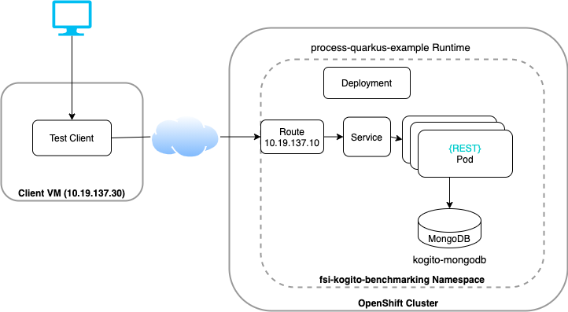
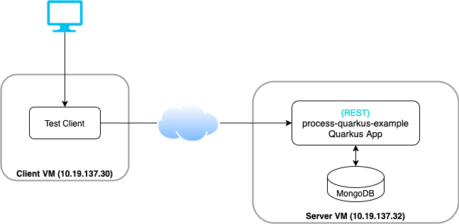

# Table of Contents
* [Kogito Benchmark](#kogito-benchmark)
  * [System Architecture](#system-architecture)
  * [Business Process Model](#business-process-model)  
  * [Test strategy](#test-strategy)
  * [Metrics specifications](#metrics-specifications)
  * [Results](#results)
  * [How to run benchmark tests](#how-to-run-benchmark-tests)
  * [References](#references)
  * [Troubleshooting](#troubleshooting)

# Kogito Benchmark

Purpose of this project is benchmarking [Kogito](https://kogito.kie.org/) application for a defined business process model 
using MongoDB as persistence store.
The objective is to define a repeatable procedure to generate structured data for the metrics defined in [Metrics specifications and results](#metrics-specifications-and-results),
to easily monitor system performance as the product evolves.  

The following table shows the configuration of the test environment

| Target   |      Specs      |
|----------|:-------------:|
| Kogito version |  1.11.0.Final |
| Runtime environment |  [OpenShift](https://console-openshift-console.apps.mw-ocp4.cloud.lab.eng.bos.redhat.com) |
| JVM runtime | Quarkus |
| Data persistence | MongoDB | 
| Test Client | [Quarkus Client](test-clients/quarkus-client) / [JMeter](test-clients/jmeter-client) |

## System Architecture
The following diagram illustrates the basic architecture of the testing scenario:



For establishing of a baseline the following architecture was used:



## Business Process Model
Originally the process-quarkus-example from the Kogito-Examples repository was used.
It was then decided to use a model with only one process instead of the above model which contains a subprocess therefore persisting 2 instead of 1 processes per test run.

The Business Process Model under test consists of 1 script task and 1 human task.
In particular, we  will create new instances of the `TestData` data element using a GET REST request.


## Test strategy

Constant concurrent users - a constant number of users is repeatedly invoking the test scenario. Each time a request finishes a new request is done.

## Metrics specifications

The test scenario were executed with varying pod numbers (# of replicas, in case of testing application on VM, all tests were on 1 app container) and number of users. 
Tests were run for a duration of 2 minutes. 

## Results

[📣 Click here to view benchmark results](./benchmark_results.md)

## How to run benchmark tests
* [Deploy kogito example app on OCP](test-envs/deploy-OCP/deploy-app/README.md)
* [Deploy kogito example app on a VM](test-envs/deploy-VM/README.md)
* [Running tests from a VM](test-envs/test/README.md)

## References
* [Project Requirements](https://docs.google.com/document/d/1AtAfTiFSB2VcI84zg-ocPTnYy_1HCK556FiWt_iPkiM/edit?usp=sharing)
* [Asana Board](https://app.asana.com/0/1200541157872337/board)
* [GitHub repository](https://github.com/RHEcosystemAppEng/kogito-benchmark)

## Troubleshooting
* Access `Swagger UI`: the URL is `ROUTE_OF_APPLICATION/swagger-ui`
* Every time a `simple` request is done, the related Pod in the OCP platform will log a message like:
```text
Received ...
```

