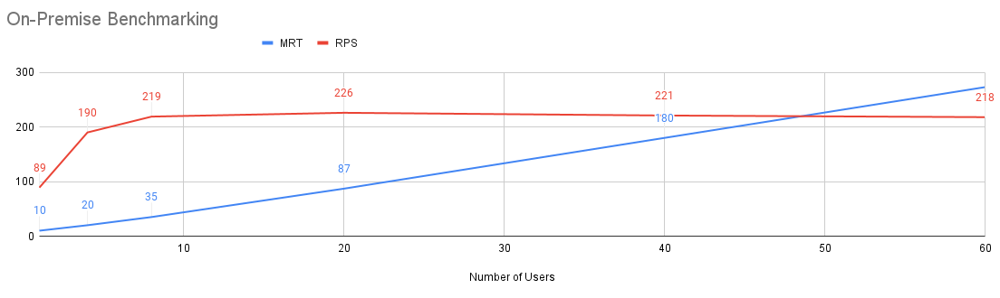
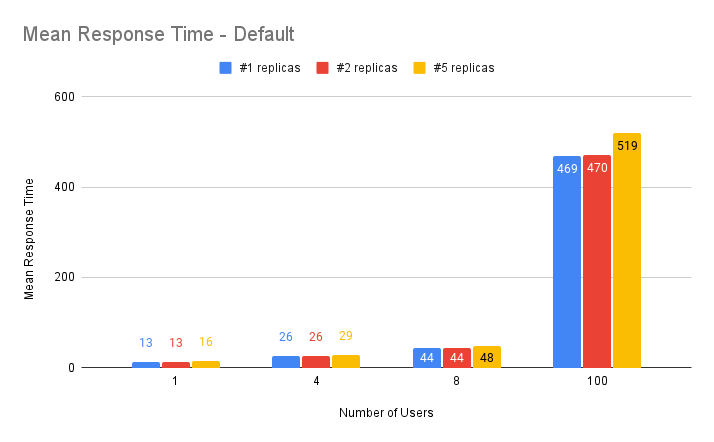
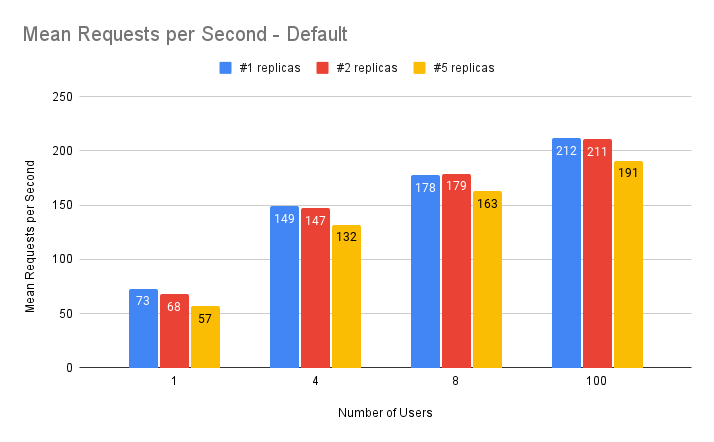
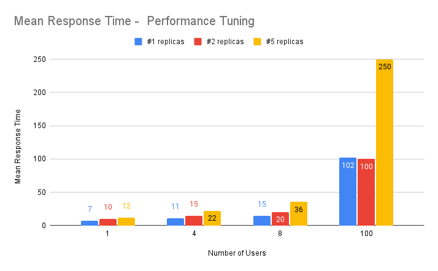
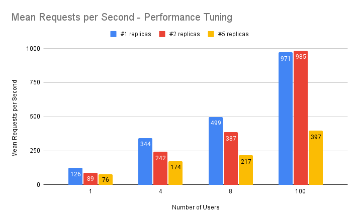

# Table of Contents

* [Benchmark Results](#-benchmark-results)
  * [VM Specification](#vm-specification-)
  * [Test Engines](#test-engines-)
  * [Common Configuration](#common-configuration-)
  * [Mongodb Caveats](#mongodb-caveats-)
  * [Results for On-Premise Deployment](#results-for-on-premise-deployment)
  * [Results for Red Hat Openshift Deployment](#results-for-red-hat-openshift-deployment)
    * [Default Configuration](#default-configuration)
    * [Performance Tuning](#performance-tuning)

# 📣 Benchmark Results

Following numbers were gathered targeting the [forked version of process-quarkus-example](https://github.com/RHEcosystemAppEng/kogito-benchmark/tree/main/test-apps/process-quarkus-example) on different compute environments.
The reason we use a forked version is we have added 3 additional business process definitions 
_([emptyProcess, notPersistedProcess](https://github.com/RHEcosystemAppEng/kogito-benchmark/tree/main/test-apps/process-quarkus-example/src/main/resources/org/kie/kogito/examples), [SimpleHT](https://github.com/RHEcosystemAppEng/kogito-benchmark/tree/main/test-apps/process-quarkus-example/src/main/resources/com/redhat/fsi))_ for our testing purposes.

A warmup test run have executed before each test to make sure intended test is not affected by any initialization processes.

Mainly 2 options were tested:
1. Kogito application deployed in a Virtual machine
2. Kogito application deployed in a Red Hat Openshift cluster.

## VM Specification 🖥️
- Intel Core i7 9xx (Nehalem Class Core i7) @2.4GHz z (4 cores / 4 threads)
- 16GB Memory
- Red Hat Enterprise Linux Server release 7.9 (Maipo)

## Test Engines 🧰
- Gatling (3.6.0)
- JMeter (5.4.1)
- Java-Quarkus ([Quarkus application written by us](https://github.com/RHEcosystemAppEng/kogito-benchmark/tree/main/test-clients/quarkus-client))

## Common Configuration ⚒️
- Java version: openjdk 11.0.12 2021-07-20 LTS
- Persistence: Mongo DB v4.4.9
- Kogito version: 1.11.0.Final
- Concurrence Strategy: CONST_CONCURRENT_USERS (Only for Gatling)

## Mongodb Caveats 🗄️
- **clean-before**: Delete all mongodb collections before the test
- **id-index**: Manually create some missing mongodb indexes before the test

## Results for On-Premise Deployment
See [tabular view](./benchmark_results_table.md#on-premise-deployment)

----

## Results for Red Hat Openshift Deployment
See [tabular view](./benchmark_results_table.md#red-hat-openshift-deployment)

### Default Configuration

----

### Performance Tuning

----

For detailed info -> [download the csv file](benchmark_detailed_info.csv)
