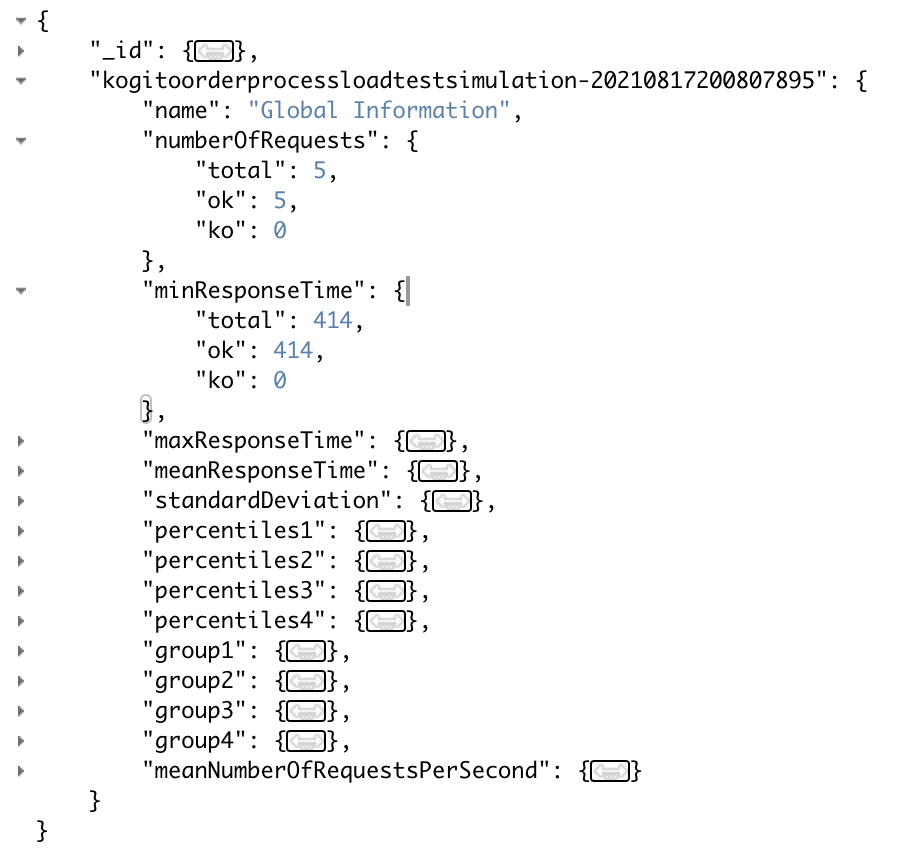

# persist-gatling-reports-to-mongodb

### Motivation 💡

Simple java program that will persist gatling test statistic data to mongodb. Intention of this
program is to use as a InitContainer in https://github.com/RHEcosystemAppEng/kogito-benchmark/blob/main/test/open-shift/pod-kogito-gatling-benchmark.yaml

### Run Configurations ⚙️

Following environment variables are required to set before running program.

| Environment variable        | Description  | Example value  |
| ------------- |:-------------| :-----|
| `GATLING_FILE_PATH_ENV`      | file path where gatling test results generated. | `/Users/jnirosha/kogito-benchmark/test/target/gatling` |
| `MONGODB_CONNECTION_URI`      | connection string to mongodb that will be used to persist gatling results. | `mongodb://<<user>>:<<pwd>>@10.88.0.1:27017` |
| `MONGODB_NAME`      | mongodb database name | `kogito_dataindex` |
| `MONGODB_COLLECTION_NAME`      | mongodb collection name | `benchmark_results` |

### How to run locally 🏃

1. Set all above mentioned environment variables.
2. execute the program using `java -jar target/persistGatlingReportsToMongodb-1.0.0-jar-with-dependencies.jar`command.

### How to build the container image 🏗️ 

1. Build the java project using `mvn clean install` 
2. Build container image using `podman build -t quay.io/<<quay.io username>>/persist-gatling-reports-to-mongodb:latest .`
3. Publish to quay.io container registry using `podman push quay.io/<<quay.io username>>/persist-gatling-reports-to-mongodb:latest`

### How to run as a container 📦

1. Download the container image using `podman pull quay.io/<<quay.io username>>/persist-gatling-reports-to-mongodb`

2. Run the container image using `podman run -d -v <<path to the locall gatling folder>>:/<<gatling file path inside the container>>:z \ 
   -e GATLING_FILE_PATH_ENV=/<<gatling file path inside the container>> \
   -e MONGODB_CONNECTION_URI=mongodb://10.88.0.1:27017 \
   -e MONGODB_NAME=Kogito_db \
   -e MONGODB_COLLECTION_NAME=benchmark_results \
   --name persist-gatling-reports-to-mongodb quay.io/<<quay.io username>>/persist-gatling-reports-to-mongodb`

## Usage

This maven project can build as a container, and it can be included as a InitContainer
in the https://github.com/RHEcosystemAppEng/kogito-benchmark/blob/main/test/open-shift/pod-kogito-gatling-benchmark.yaml 
file. This will save the results in the given mongodb instance.

`kogito-persist-gatling-results-to-mongo-crendentials` is a dedicated secret file which include the 
`MONGODB_CONNECTION_URI` and its corresponding value *(Connection String)*.

### Output
`global_stat.json` file will be saved in the configured collection. It will be saved as 

`gatling_simulation_id : global_stat_json_file_content`

