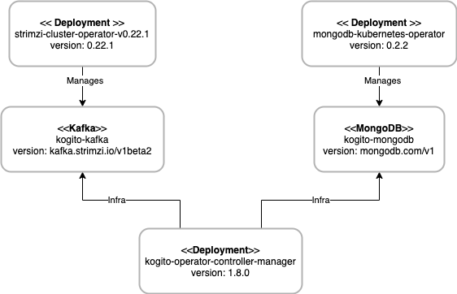

# Table of Contents
* [Deploying the Kogito infrastructure](#deploying-the-kogito-infrastructure)
  * [Prerequisites](#prerequisites)
  * [Install the MongoDB operator](#install-the-mongodb-operator)
  * [Deploy the MongoDB instance](#deploy-the-mongodb-instance)  
  * [Install MongoDB infra in Kogito operator](#install-mongodb-infra-in-kogito-operator)
  * [Install the Kafka operator](#install-the-kafka-operator)
  * [Deploy the Kafka instance](#deploy-the-kafka-instance)  
  * [Install Kafka infra in Kogito operator](#install-kafka-infra-in-kogito-operator)
* [Deploying the Kogito App](#deploying-the-kogito-app)
* [Troubleshooting Tips](#troubleshooting-tips)  
  * [MondoDB Collections](#mondodb-collections)  
* [References](#references)
    
# Deploying the Kogito infrastructure
**Following steps have been validated against Kogito version 1.8.0.Final**

The kogito infrastructure is made of:
* MongoDB operator
  * Manages the `kogito-mongodb` instance
* Kakfa/Strinzi operator
  * Manages the `kogito-kafka` instance
* Kogito operator, with infra:
  * kogito-mongodb-infra
  * kogito-kafka-infra

The following diagram illustrates the infrastructural components of the testing environment:



## Prerequisites
* Have [oc](https://docs.openshift.com/container-platform/4.7/cli_reference/openshift_cli/getting-started-cli.html)
and [kogito](https://docs.jboss.org/kogito/release/latest/html_single/#con-kogito-on-ocp_kogito-deploying-on-openshift)
CLI tools
* Login to OCP with `oc login` to the target OCP platform [TDB] 
* Create a new project `PROJECT_NAME` with `oc new-project` or `kogito new-project`
* Install the Kogito operator from the OCP console in the `PROJECT_NAME` namespace.

## Install the MongoDB operator
The Kogito Operator is validated against [MongoDB Community Kubernetes Operator 0.2.2](https://github.com/kiegroup/kogito-operator#kogito-operator-tested-integrations), 
which is installed from the [MongoDB Community Kubernetes Operator](https://github.com/mongodb/mongodb-kubernetes-operator) 
repository:
```shell
git clone git@github.com:mongodb/mongodb-kubernetes-operator.git
cd mongodb-kubernetes-operator
git checkout v0.2.2
```

To properly deploy on OpenShift, we have to add the following property to the file `deploy/operator.yaml`,
under the `spec.template.spec.env` section:
```yaml
            - name: MANAGED_SECURITY_CONTEXT
              value: 'true'
```

Finally, we can install the `CustomResourceDefinition` of kind `MongoDB`  and all the resources of the operator:
```sh
oc create -f deploy/crds/mongodb.com_mongodb_crd.yaml
oc create -f deploy/
```

To fix the issue [Unable to deploy Mongodb Replica Set on Openshift](https://github.com/mongodb/mongodb-kubernetes-operator/issues/212#issuecomment-704744307),
we have to execute the following command:
```sh
oc adm policy add-scc-to-user anyuid system:serviceaccount:`oc project -q`:mongodb-kubernetes-operator
```
## Deploy the MongoDB instance

#### Create MongoDB
We create the MongoDB instance using the given [kogito-mongodb.yml](kogito-mongodb.yml) YAML configuration from 
the root of the `kogito-benchmark` repository:
```shell
oc create -f test-envs/deploy-OCP/deploy-app/kogito-mongodb.yml
```
This creates one instance `kogito-mongodb` of type `MongoDB` named in the OCP cluster.
In case of successful deployment, you can see 3 Pods named `kogito-mongodb-[0-2]` in `Running` state.
In case of issues, start troubleshooting from the log of the Pod named `mongodb-kubernetes-operator-NNN`.

#### Delete MongoDB
In case we need to redeploy MongoDB, we need to first delete the old deployment:
```shell
oc delete -f test-envs/deploy-OCP/deploy-app/kogito-mongodb.yaml
```
Make sure all pods were deleted.
If we are trying to reinstall because of some node problem (node where mongo pds are deployed is e.g "Nor Ready" and needs to be restarted), make sure all
pods were removed. If we have some stuck in "Terminating" on the problematic node, we can try to delete them one by one without waiting for node restart with:
```shell
oc delete pod kogito-mongodb-<pod number> -n fsi-kogito-benchmarking --grace-period=0 --force
```

## Install MongoDB infra in Kogito operator
Once the MongoDB instance has been created, we can set up the Kogito infrastructure with:
```shell
kogito install infra kogito-mongodb-infra --kind MongoDB \
--apiVersion mongodb.com/v1 --resource-name kogito-mongodb \
--property username=developer --property database=kogito_dataindex
```
If the creation is successfull, you can see the `kogito-mongodb` instance in the `Kogito Infra` tab of the Kogito operator,
with Status equal to `Condition: Configured`


## Install the Kafka operator
We install the Kafka operator from the OCP console: select the operator `Strimzi 0.22.1 provided by Strimzi` and install it
in the project namespace.


## Deploy the Kafka instance

#### Create Kafka
Once the Kafka operator is installed, we create one instance `kogito-kafla` of the managed type `Kafka`, from the given [kogito-kafka.yml](kogito-kafka.yml)
YAML configuration, starting from the root of the `kogito-benchmark` repository::
```shell
oc create -f test-envs/deploy-OCP/deploy-app/kogito-kafka.yml --namespace `oc project -q`
```
In case of successful deployment, you can see 2 Pods named `kogito-kafka-[0-1]` and 2 Pods `kogito-kafka-zookeeper-[0-1]`
in `Running` state.

#### Delete Kafka
In case we need to redeploy Kafka, we need to first delete the old deployment:
```shell
oc delete -f test-envs/deploy-OCP/deploy-app/kogito-kafka.yaml
```
Make sure all pods were deleted. See [Mongo delete deployment](#delete-mongodb) for more details.


## Install Kafka infra in Kogito operator
Once the Kafka instance has been created, we can set up the Kogito infrastructure with:
```
kogito install infra kogito-kafka-infra \
--kind Kafka \
--apiVersion kafka.strimzi.io/v1beta2 \
--resource-name kogito-kafka
```

** WIP***
## Install Data-Index infra in Kogito operator
```
kogito install data-index \
--image kogito-data-index-mongodb \
--infra kogito-mongodb-infra \
--infra kogito-kafka-infra
```


---

# Deploying the Kogito App

#### Deploy Process Application
Starting from any folder, we can checkout the `kogito-benchmark` repository and then use kogito-cli to deploy the application.

```
git clone https://github.com/RHEcosystemAppEng/kogito-benchmark.git
cd kogito-benchmark/test-apps/process-quarkus-example
```

```
kogito deploy-service process-quarkus-example . --infra kogito-mongodb-infra --infra kogito-kafka-infra \
--build-env MAVEN_ARGS_APPEND="-Dquarkus.profile=mongo -Pmongo" --replicas 2 
```

Once the builds succeeds, you should see number of pods that we specified in our previous kogito command(`--replicas`). 
Pods will be named similar to `process-quarkus-example-NNN` in `Running` state, and a [Route](https://docs.openshift.com/enterprise/3.0/architecture/core_concepts/routes.html) named 
`process-quarkus-example` to expose the  kogito application REST APIs outside the OCP cluster.

You can access the Swagger API by adding `/q/swagger-ui` to the route location, and test them out.

#### Delete Process Application

Before redeploying the service, it should be first deleted:
```
kogito delete-service process-quarkus-example
```

# Troubleshooting Tips
## MondoDB Collections
Enter the Terminal tab of one of the running `kogito-mongodb-NN` pods, and select the `mongod` container.
Then run the following commands to verify the content of the database:
```shell
mongo -u developer
show dbs
use kogito_dataindex
show collections
db.demo.orders.count()
```

## Route not working because of broken Node
* Error message was: `curl: (52) Empty reply from server`
* Root cause: the Node hosting the pod of the Route was failing because of `open /var/run/containers/storage/overlay-layers/.tmp-mountpoints.json121923199: no space left on device`
* Solution: schedule the pod on a different Node:
```shell
oc get pods -n openshift-ingress
oc delete pod <PROBLEM_POD> -n openshift-ingress
```

# References
* [Kogito docs](https://docs.jboss.org/kogito/release/latest/html_single)
* [QE test code in kogito-operator repository](https://github.com/kiegroup/kogito-operator/tree/master/test)
  * [Travel Agency example](https://github.com/kiegroup/kogito-operator/blob/master/test/features/deploy_travel_agency.feature)
* [Marian Macik](https://rover.redhat.com/people/profile/mmacik): Kogito QE
* [Ricardo Zanini Fernandes](https://rover.redhat.com/people/profile/ricferna): Kogito SE
